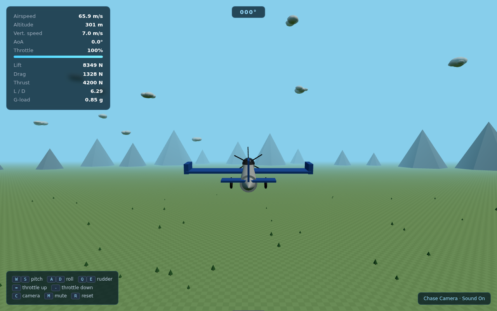

# Flight Lab

A small physics-driven 3D flight sandbox. One HTML file, no build step, no
server — open it in a browser and it runs.

## Running it

Open `flight_lab.html` in any modern desktop browser. It fetches
[three.js](https://threejs.org) from a CDN at load time (the one external
request the app makes) — everything else, geometry, physics, HUD and engine
sound, is generated in the page itself.

## Controls

| Key | Action |
|---|---|
| `W` / `S` | Pitch |
| `A` / `D` | Roll |
| `Q` / `E` | Rudder |
| `=` / `-` | Throttle up / down |
| `C` | Toggle chase / cockpit camera |
| `M` | Mute engine sound |
| `R` | Reset to a clean climb-out |

## What's under the hood

The flight model isn't a canned animation — lift, drag, stall and stability
are computed every frame from actual aerodynamic coefficients (`CL`, `CD`,
angle of attack, dynamic pressure, Oswald efficiency), integrated against a
quaternion-based rigid body. Push past the critical angle of attack and lift
actually falls off; the AoA readout goes red and "STALL" appears. It's an
arcade-simplified model, not a certified simulator, but the numbers on the
HUD are real outputs of the equations, not decoration.

The engine sound is fully synthesised — two detuned sawtooth oscillators
through a lowpass filter, both tied to throttle — so there's no audio asset
to ship. Scenery (mountains, scattered trees, runway markings) is generated
procedurally at load time for the same reason: the whole thing is one
portable file.

## Status

Still evolving. Started from a first draft and reworked since: added
landing gear, a compass, a throttle gauge, horizon scenery, runway
markings, synthesised engine sound, and a start screen (also needed to
unlock audio, since browsers block sound until a user gesture).
